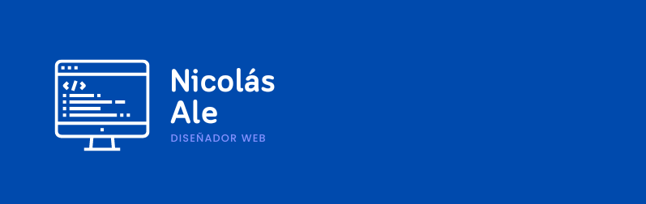

### ***Connect with me:***
   
### ***Lenguajes y Base de datos***
   
   
   
   
   

   ### ***Herramientas:***
   
   
   
   
   
   

> - 🌱 Actualmente estoy aprendiendo HTML, CSS, JavaScript , React.js, Node.js.
> - 🔭 Mi tiempo libre lo utilizo para mejorar mis diseños y creacion de paginas web.
> - 💬 Los primeros lenguajes de programacion que utilice fueron C y Java .
> - ⚡ Dato curioso: mi primera línea de código no fue "¡Hola mundo!"
> - 😀 Pregúntame por Cafe de especialidad y Messi.

Ultima edicion: 07/09/2023
